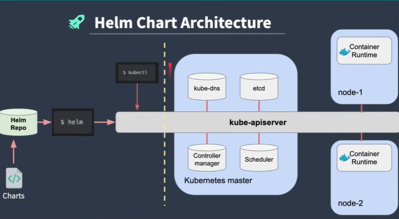
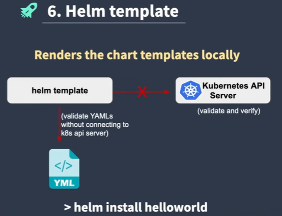

# Helm Chart

Absract framework sits over Kubernetes Cluster. Minimal helm chart command to communicate with our K8 cluster.

## How Kubernetes help with containers

1. Scalability - You can scale number of docker containers to serve millions of reqeusts
2. Automate Docker Deployment - k8s can help you to manage automate the docker deployment
3. Auto-healing - If a container is not healthy the k8s can auto replace the container
4. Rollout and Rollback - k8s monitors the uhealthy docker container and restart unresponsive.

## helm commands

- helm install <chart-file>
- helm uninstall <chart-file>

## Helm Char Architecture



- left hand side is helm chart
- right side is kubernets cluster

## Basic HELM cli commands

- helm create <helloworld(helm chart name)>
- helm install myhelloworld<FIRST_ARGUMENT_RELEASE_NAME> helloworld<SECOND_ARGUMENT_CHART_NAME>
- helm delete myhelloworld
- helm list -A

### to check where exactly our service is running

```
kubectl get service
```

```
NAME           TYPE        CLUSTER-IP      EXTERNAL-IP   PORT(S)        AGE
kubernetes     ClusterIP   10.**.**.**       <none>        443/TCP        71m
myhelloworld   NodePort    10.**.**.**       <none>        80:31486/TCP   3m7s
```

### helm cli more commands

```
helm create
helm install
helm upgrade <release name> <chart name> -> to install new changes and will increase revision number
helm rollback <release name> <revision_number(to which you want to rollback)>

helm -debug -dry-run (validate your helm chart before install)
example:- helm install myhelloworldrelease --debug --dry-run helloworld


helm template <chart name>
helm lint <chart nane> (use to verify if there any misconfiguration or error associated with helm chart)
hlem uninstall <chart release name>
```

